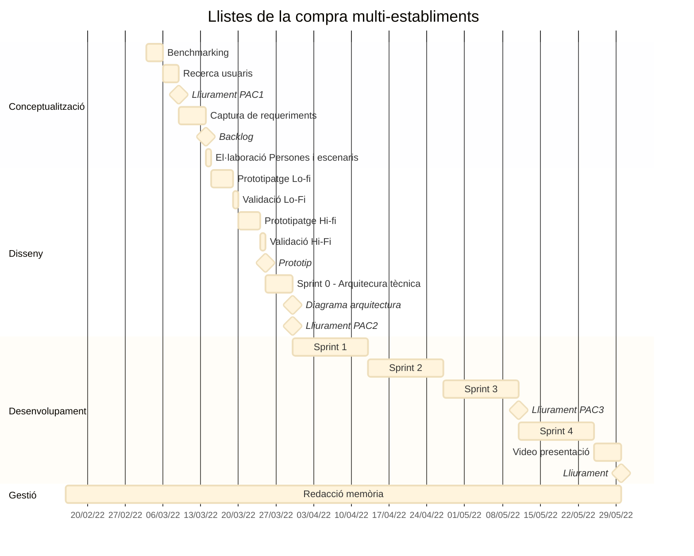

```mermaid
%%{init: {'theme':'base'}}%%
gantt
todayMarker off
dateFormat  DD-MM-YYYY
axisFormat  %d/%m/%y
title Llistes de la compra multi-establiments
section Conceptualització
Benchmarking: c0, 03-03-2022, 3d
Recerca usuaris: c1, after c0, 3d
Lliurament PAC1 : milestone, m1, 09-03-2022, 2min
Captura de requeriments : c1, after m1, 5d
Backlog: milestone, backlog, after c1, 2min
El·laboració Persones i escenaris : c3, after c1, 1d
section Disseny
Prototipatge Lo-fi: d1, after c3, 4d
Validació Lo-Fi: d2, after d1, 1d
Prototipatge Hi-fi: d3, after d2, 4d
Validació Hi-Fi: d4, after d3, 1d
Prototip: milestone, prototip, after d4, 2min
Sprint 0 - Arquitecura tècnica : d5, after d4, 5d
Diagrama arquitectura: milestone, arch, after d5, 2min
Lliurament PAC2 : milestone, m2, 30-03-2022, 2min
section Desenvolupament
Sprint 1: devel1, after m2, 14d
Sprint 2: devel2, after devel1, 14d
Sprint 3: devel3, after devel2, 14d
Lliurament PAC3 : milestone, m3, 11-05-2022, 2min
Sprint 4: devel4, after m3, 14d
Video presentació : video, after devel4, 5d
Lliurament : milestone, mFinal, 30-05-2022, 2min
section Gestió
Redacció memòria: memoria, 16-02-2022, 30-05-2022
```
